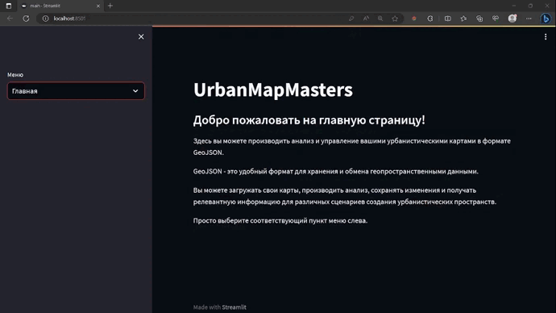

# Arctic Access - Проект Ikanam

Проект Arctic Access изменит жизнь на этих землях, оптимизируя размещение городских объектов с учетом транспортной доступности в Арктической зоне.

## О проекте

Проект Arctic Access представляет собой веб-сервис, разработанный командой Ikanam. Мы используем алгоритмы машинного обучения и продвинутый анализ данных для определения оптимального местоположения объектов в Арктической зоне. Наш сервис визуализирует карты регионов и городов в удобном формате для пользователя.

## Как запустить

Для запуска веб-сервиса Arctic Access, выполните следующую команду:

streamlit run main.py

## Преимущества проекта

- Повышение качества жизни жителей Арктической зоны, размещая медицинские и образовательные учреждения в оптимальных зонах для большинства населения.
- Размещение остальных учреждений с учетом потребностей жителей и транспортной доступности, оптимизированное с использованием алгоритмов искусственного интеллекта.
- Сокращение человеческих просчетов и экономия бюджета за счет использования вычислительных мощностей для выбора оптимальных решений.
- Повышение туристической привлекательности региона через развитие инфраструктуры российской Арктики.

Мы стремимся сделать Арктическую зону более комфортным и эффективно развивающимся местом для жизни и работы.

## Структура репозитория

- `app`: Здесь содержатся файлы веб-сервиса Arctic Access.
- `data`: Данные, используемые для обучения алгоритмов машинного обучения и анализа.
- `login_status.txt`: Файл с информацией о статусе входа пользователей (не включен в .gitignore).
- `main.py`: Главный файл веб-сервиса Arctic Access.
- `notebooks`: Jupyter-ноутбуки с анализом данных и обучением моделей.
- `requirements.txt`: Файл с зависимостями проекта.
- `utils`: Пакет с утилитами и вспомогательными функциями.
